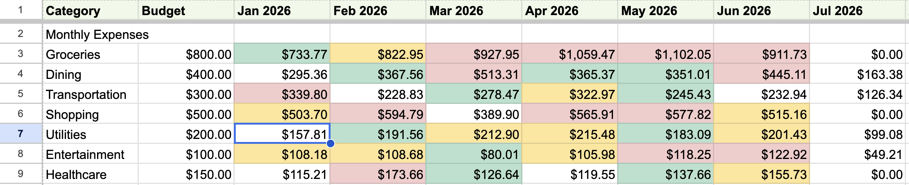
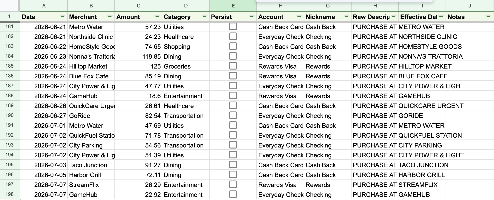
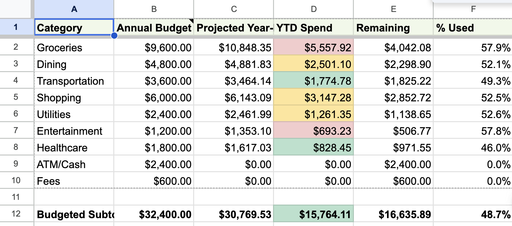
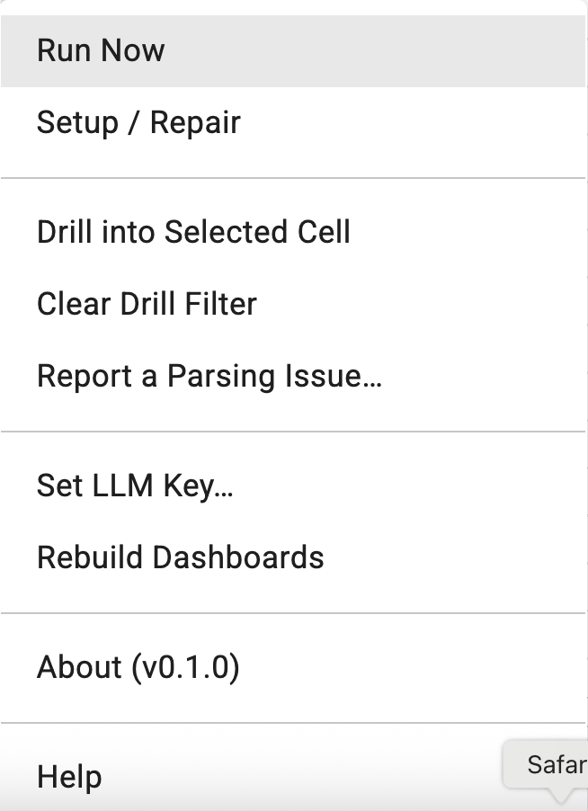
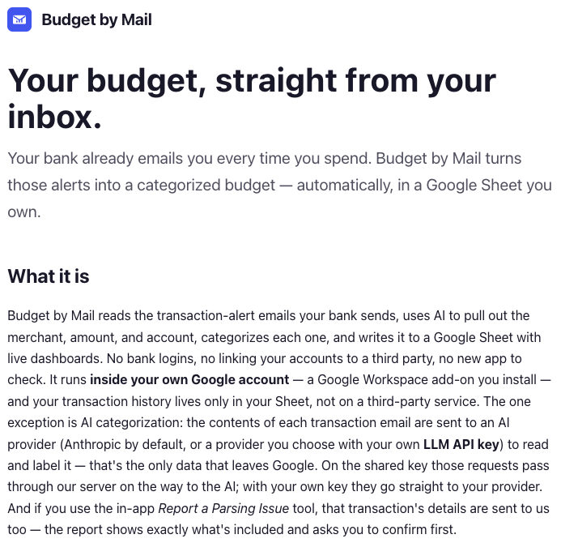

**See it:** [https://budgetbymail.com](https://budgetbymail.com) · Invitation-only early access · Free · Runs inside your own Google account (Google Sheets add-on)

**See it:** https://budgetbymail.com · Invitation-only early access · Free · Runs inside your own Google account (Google Sheets add-on)

*The Monthly Dashboard — your whole year at a glance. Categories down the side, months across the top, each cell color-coded by how spending tracks against its budget. It's all formulas, so it recomputes itself the moment a new transaction lands.*

### What it is

Budget by Mail is a personal budget tracker that runs on the emails you already get. Every time you spend, your bank sends a transaction alert; Budget by Mail catches those, reads them, and turns them into a living budget in a Google Sheet you control. No bank logins, no linking accounts to a third-party aggregator, no new app to open every day — just the notifications already sitting in your inbox, quietly assembled into a picture of where your money goes.

The whole thing lives in *your* Google account. Budget by Mail is a Google Workspace add-on bound to your spreadsheet, so your transaction history stays in your Sheet and the code runs as you — there's no external dashboard holding your financial life.

### How it works

The pipeline is three simple steps, and after setup it's completely hands-off:

1. **A Gmail filter routes the alert.** You add a filter so your bank's transaction emails get labeled `budget-by-mail/inbox` (and, if you like, skip your inbox entirely).
2. **Budget by Mail reads and categorizes.** Once an hour it picks up new alerts, and an AI model extracts the merchant, amount, date, and account from each one, assigns a category, and de-duplicates — so a pending-then-posted charge only counts once.
3. **Rows land in your Sheet.** Each transaction is appended to the Transactions tab, and every dashboard recomputes automatically.

*The Transactions sheet, populated straight from your bank emails — date, merchant, amount, category, and account, all parsed for you. The "Persist" checkbox is how you teach it (more below).*

### Dashboards that build themselves

Because the program only ever *appends* transactions and every summary is a spreadsheet formula, your dashboards are always live — and anything you edit by hand flows straight through. Beyond the Monthly view above, an **Annual Dashboard** shows year-to-date spending against your annual budget for each category, plus a projected year-end pace so you can see who's trending over before the year is out.

*The Annual Dashboard — year-to-date spend versus each category's annual budget, with a projected year-end total so overspending shows up early. Budgets prorate automatically if you start tracking mid-year.*

### The full picture: cash flow and trends

Budget by Mail isn't only about spending. Mark your income and it builds a **Cashflow** view — money in versus money out — and a **Trends** view that charts categories over time, so you can see the shape of your finances, not just this month's numbers.

### It learns your corrections

AI categorization is good, but you know your merchants better. When it gets one wrong, fix the **Category** cell and tick the **Persist** checkbox on that row. From then on, Budget by Mail remembers that merchant → category as a rule and applies it to every future transaction automatically — no AI guess, no repeat corrections. Your budget gets more accurate the more you use it.

### Private by design

Budget by Mail runs inside your own Google account, and your transaction history lives only in your Sheet — not on anyone's server. The one place data leaves Google is AI categorization: the contents of each transaction email are sent to an AI provider (Anthropic by default, or a provider you choose with your own API key) to read and label it. That's disclosed plainly, it's the only data that leaves your account in normal use, and there's no selling, ad-targeting, or model-training on your data.

### How you run it

There's nothing to install on your computer. You install the add-on into your Google account, open a Google Sheet, and everything happens from an **Extensions → Budget by Mail** menu — Setup builds the tabs, and from then on it runs on its own each hour (with a "Run Now" button for the impatient).

*Everything runs from the Extensions → Budget by Mail menu inside Google Sheets — run on demand, re-run setup, rebuild dashboards, or report a mis-parsed transaction.*

New users start on a **shared AI key** (no account or API key required); anyone who prefers can drop in their own Anthropic, OpenAI, or Gemini key and use their own quota.

### About

Budget by Mail is an independent project by WheelerWorks. It began as a local command-line tool and grew into a Google Workspace add-on so it could run for anyone, entirely inside their own Google account.

**Requesting access.** Budget by Mail is invitation-only while it's in early access, so spots are limited for now. If you'd like to try it, visit **[budgetbymail.com](https://budgetbymail.com)** and request access — you'll be added as capacity opens up.

*budgetbymail.com — where you request access and, once approved, get the full setup guide.*
