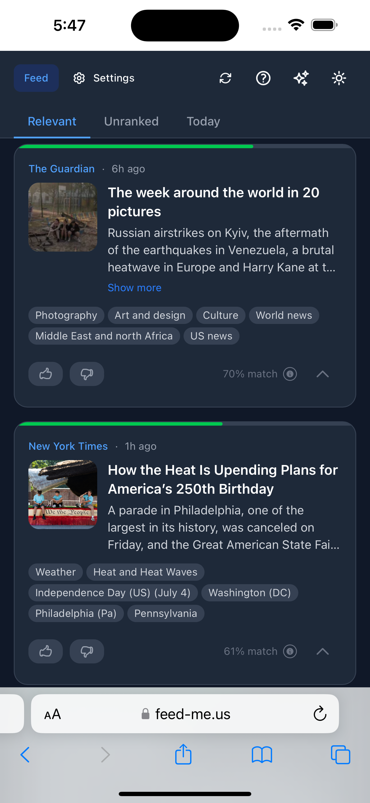
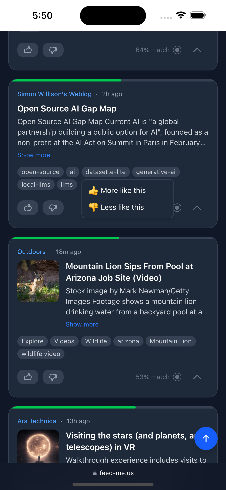
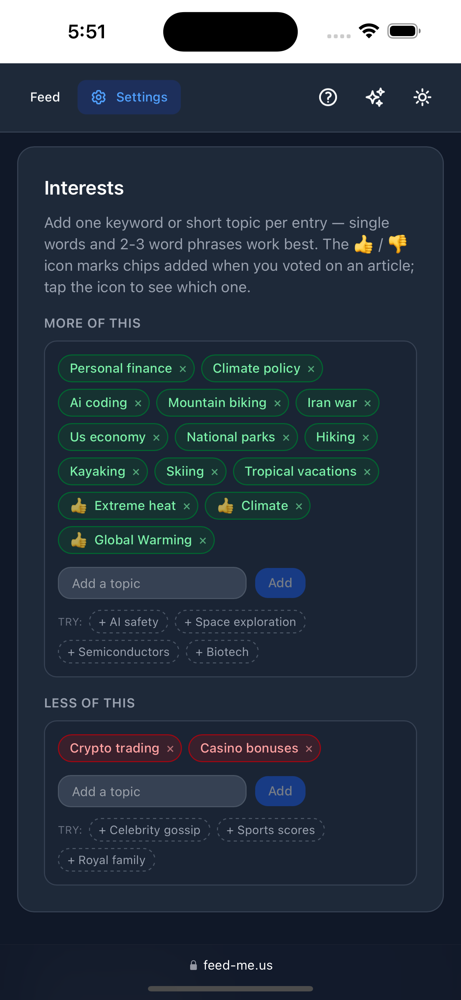
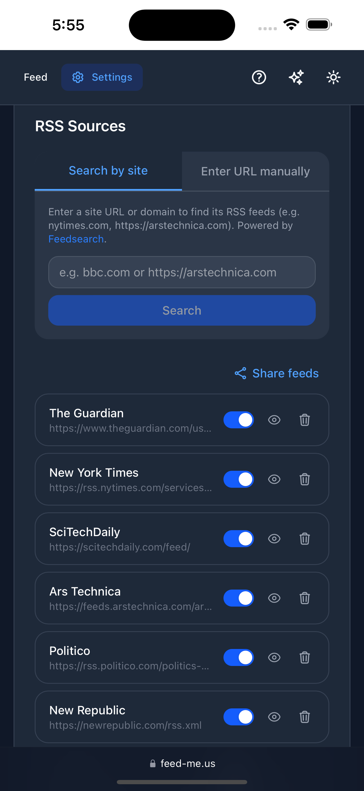
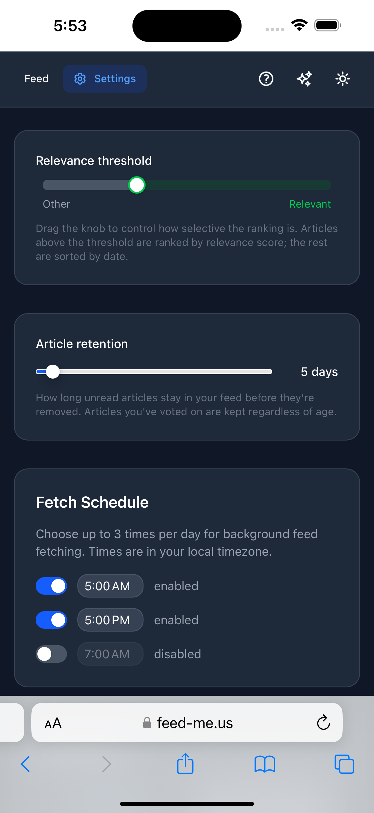

*The main feed — your sources, ranked. Each card shows how relevant Feed Me thinks the article is to you, with topic keywords you can tap to teach it. The top bar switches between Relevant, Unranked, and Today, and refreshes on demand.*

### What it is

Feed Me is a news aggregator that ranks articles by **your** taste. You bring the sources — any site that publishes a feed — and a short list of interests, and Feed Me does the reading: it scores every incoming article against a model of what you care about and floats the good stuff to the top, so the first thing you see is the thing most worth your time.

It's built for people who follow a lot of sources but don't want to wade through everything to find the handful of articles that matter. Think of it as a personal editor that quietly learns what you'd keep and what you'd skip.

### It learns what you like

Feed Me starts with the topics you give it and gets better from there. You teach it three ways, and they all feed the same ranking:

- **Interests** — a simple chip editor with two lists: **More of this** and **Less of this**. Type a topic, press enter, done. Positive topics pull matching articles up; negative topics push them down.
- **Voting** — thumbs-up or thumbs-down any article. Your votes refine the ranking and can suggest new topics to add.
- **Tapping keywords** — every article shows the topics it was tagged with. Tap one and choose *More like this* or *Less like this* to add it to your interests or dislikes on the spot. Topics you already follow light up green (👍) or red (👎) right on the article, so you can see — and adjust — your taste as you read.

*Tap any topic keyword and choose to see more or less like it — the same signal as voting, so the feed re-ranks to match. Keywords already in your interests appear highlighted green or red, and the menu then also lets you switch or remove them.*

Behind the scenes, Feed Me uses AI to turn your short list of topics into the kind of rich description its ranking model reads best, and to suggest fresh topics based on what you actually read — so a few quick taps go a long way.

### Interests you can actually manage

All of it lives in one place. The **Interests** editor collects everything — topics you typed and topics you picked up while voting or tapping keywords — into the same two lists, each editable in a tap. It's easy to see, at a glance, exactly what Feed Me thinks you want.

*Your interests, in one editor — “More of this” and “Less of this,” with topics you added while voting or reading folded into the same lists. Everything is editable in a tap.*

### Your sources, your way

Feed Me works with any site that publishes a feed. Adding sources is painless:

- **Add by URL or search** — paste a site or feed address, or search by name and let Feed Me discover the feed for you. Sites without a feed say so clearly.
- **Focus mode** — zero in on a single source with one tap; the feed filters to just that source until you exit.
- **Mute and manage** — pause a noisy source without deleting it, or remove it entirely. Everything's in one tidy list.

*Manage your sources in one place — add by URL or by searching for a site, focus the feed on just one source, or mute the noisy ones.*

### Tuned to you

A few dials let you shape the experience without fuss:

- **Relevance threshold** — decide how picky the Relevant view is: only the strongest matches, or a wider net.
- **Retention** — how many days of articles to keep around.
- **Fetch schedule** — how often Feed Me checks your sources for new articles in the background, plus a one-tap **refresh** whenever you want the latest right now.

*Simple dials — how selective the Relevant view is, how long to keep articles, and how often to check your sources.*

### Built to live on your devices

- **Three views** — **Relevant** (ranked for you), **Today** (everything from the last 24 hours, newest first), and **Unranked** (nothing filtered out).
- **Installable** — add it to your home screen or desktop and it runs like a native app, on phone or laptop.
- **Yours and private** — sign in with your Google account; your sources, interests, and reading stay tied to you.
- **Always improving** — a built-in “What's new” log keeps you posted, and a feedback link goes straight to the maker.

### About

Feed Me is a WheelerWorks project — a personal news reader for people who'd rather train their own feed than be trained by one. It's powered by Claude for the parts that need to understand language, and by open-source models for fast, on-the-fly relevance ranking.
