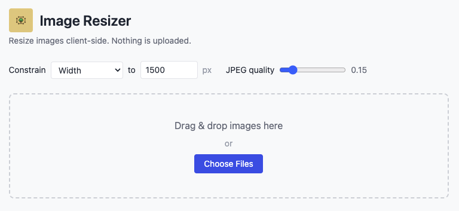
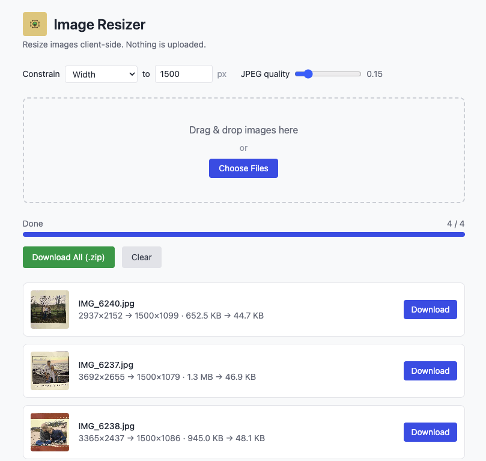

*The whole app on one screen — set how big you want the images and how much to compress them, then drop your files in. No menus, no steps, no sign-up.*

### What it is

Image Resizer is a dead-simple tool for making image files smaller. Point it at a photo — or a hundred photos — tell it the largest dimension you want and how aggressively to compress, and it hands back tidy, web-ready JPEGs. It's the tool you reach for before emailing a batch of pictures, uploading product shots, attaching images to a listing, or trimming a folder of iPhone photos down to a sensible size.

The catch that makes it different: **it never uploads your images.** Everything happens inside your browser, on your computer. Your photos never leave your device, which makes it fast, private, and usable even with no internet connection.

### How it works

There's nothing to learn. The entire app is a single page:

- **Choose what to constrain.** Cap the **width**, the **height**, or the **longest side** of each image, and set the maximum size in pixels (the default is 1500px). Images larger than that are scaled down proportionally; smaller ones are left at their original size.
- **Set the JPEG quality.** A single slider trades file size against visual fidelity — nudge it down for smaller files, up for crisper detail.
- **Add your images.** Drag and drop them anywhere on the drop zone, or click to pick files. You can process one image or a big batch at once.

As it works, a progress bar tracks the batch, and each finished image appears in a list with a thumbnail and the numbers that matter: its **before and after dimensions** and its **before and after file size**, so you can see at a glance exactly how much space you saved.

*After processing, every image reports its before-and-after dimensions and file size. Download them individually, or grab the whole batch as a single zip.*

### Handles the formats you actually have

Image Resizer reads **JPEG, PNG, WebP, and HEIC/HEIF** — including the HEIC photos an iPhone produces by default, which many tools and websites refuse to open. It converts those automatically. Whatever you feed it, it outputs clean, universally compatible **JPEG** files.

### Downloading

Grab results however suits you:

- **One at a time** — each image in the list has its own Download button.
- **All at once** — the **Download All (.zip)** button bundles the entire batch into a single dated zip file, so a folder of fifty photos is one click and one download.

### Private by design

Because all the work happens locally in your browser:

- **Nothing is uploaded.** Your images never touch a server — there's no account, no cloud, no "we process your files" fine print.
- **It's fast.** No waiting on uploads or downloads; resizing happens at the speed of your own machine.
- **It works offline.** Once the page has loaded, you don't need a connection to use it.
- **Your settings stick.** Your preferred dimension, quality, and constraint are remembered between visits.

### Install it like an app

Image Resizer is a **Progressive Web App**, so you can add it to your Mac's Dock, your Windows taskbar, or your phone's home screen and launch it in its own window — no browser tabs, no address bar. Once installed it runs fully offline, so it's always a click away when you need to shrink a photo.

### About

Image Resizer is a small, free utility with no ads, no tracking, and no account. It does one thing well: makes your images smaller, privately, right in your browser.
