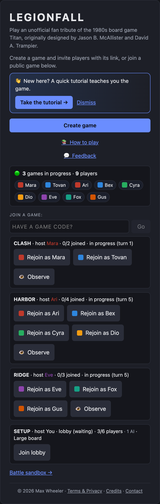
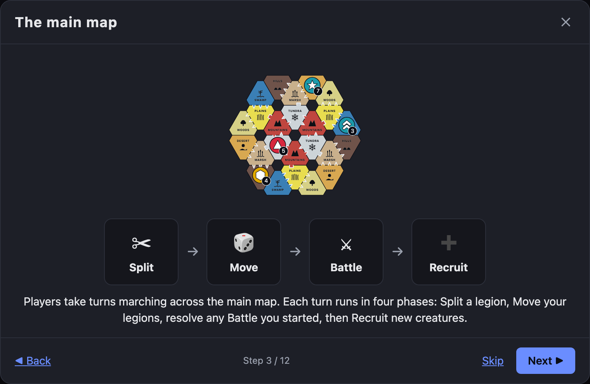
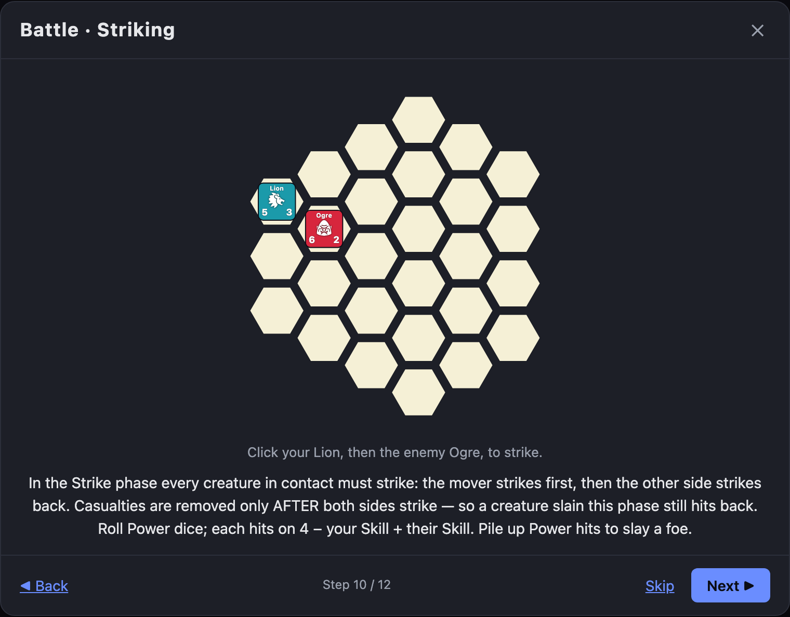
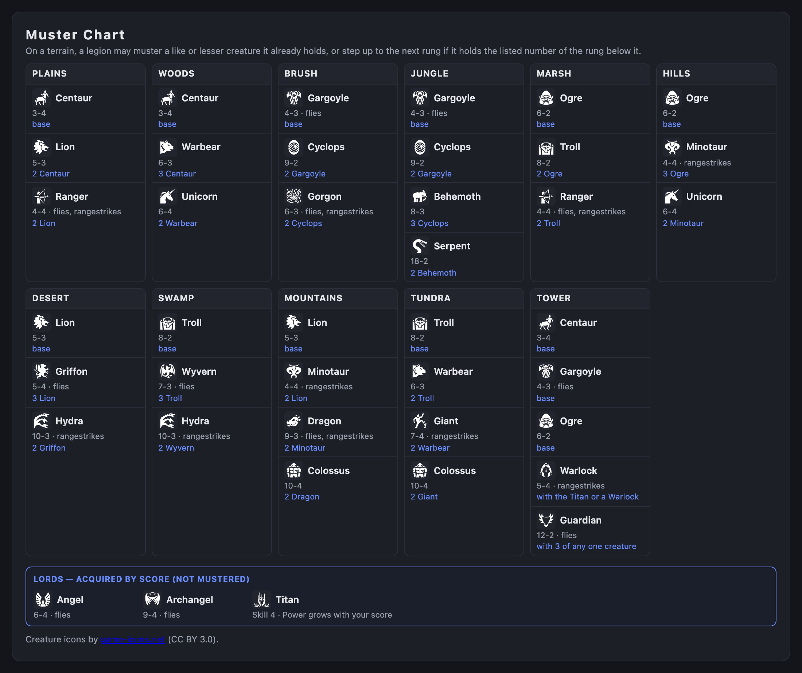
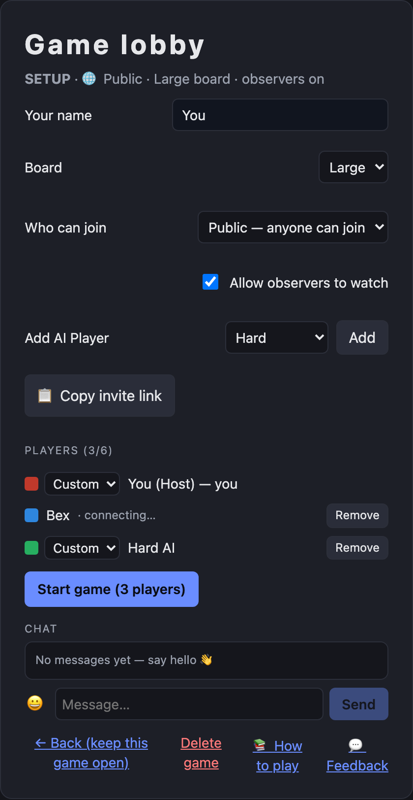

**Play it:** [https://legionfall.us](https://legionfall.us) · Free · No account required · Runs in any modern browser (desktop & tablet)

*The home screen — start a game, join a public one, or enter a code. A live panel shows how many games are in progress and who's playing right now.*

### What it is

LEGIONFALL is a fantasy battle game of growing armies. Each player commands a **Titan** and a band of legions that march across a shared **overworld** and collide on tactical **battlelands**. Recruit ever-mightier creatures from the terrain you occupy, maneuver for position, and try to destroy your rivals' Titans before they destroy yours. Lose your Titan and you're out; the last player standing wins.

It's a faithful, from-scratch reimplementation of the beloved 1980s board game *Titan* — brought online with everything the tabletop version couldn't offer: instant setup, shareable invite links, AI opponents, an in-app tutorial, and a rulebook you can search.

### How a turn works

Play is turn-based and easy to learn but deep to master. Each of your turns runs through three phases:

- **Commencement** — you may **split** a legion, peeling creatures off into a new stack. Splitting is how your army multiplies across the board, but it spreads you thin: both halves must keep at least two creatures.
- **Movement** — roll the movement die and march your legions. Move into a land already holding an enemy legion and you start an **engagement** — a battle.
- **Enlistment** — every legion that moved may **muster** one new creature from the terrain it now stands on. Hills breed different monsters than marshes or mountains, so where you go shapes what you can recruit.

*The main map, with legions (the numbered tokens) spread across the terrain — and the four phases of every turn: split a legion, move, resolve any battle, then recruit. (Shown in the game's built-in tutorial.)*

### Battles

When two legions meet, the game drops into a **battleland** — a hex map with its own terrain, hazards, and native advantages. This is where LEGIONFALL earns its name.

Every creature has two factors: **Power** (how many dice it rolls when it strikes, and how many hits it can take before it falls) and **Skill** (how far it moves and how accurately it strikes). A creature's point value is simply Power × Skill. In battle you maneuver your creatures, then resolve **strikes** in close combat and **rangestrikes** from afar — with bonuses and penalties from terrain, elevation, and whether a creature is fighting on its native ground. Positioning matters as much as raw strength: a well-placed line can grind down a bigger stack.

*A battle on the 27-hex arena — here a Lion (Power 5 / Skill 3) meets an Ogre (Power 6 / Skill 2). Creatures in contact strike each other; Power sets the dice rolled and hits absorbed, Skill the reach and accuracy. (Shown in the game's built-in tutorial.)*

### Growing your legions

Winning battles is only half the game — the other half is building an army worth fielding. **Mustering** lets each moving legion recruit a creature from its terrain, climbing a ladder from humble Centaurs and Ogres up to Wyverns, Giants, Dragons, Hydras, and Colossi. Score enough points and you can summon **Angels** and **Archangels** — flying lords that can be teleported straight into a battle to turn the tide.

*The built-in muster chart — a live reference for what each land recruits and how the creature ladder climbs.*

### Winning

Win a battle and you eliminate the loser's legion and add its point value to your score. Slay a player's Titan and that player is out. When only one player remains, they win.

Scoring feeds back into power: a **Titan's Power grows with its owner's score** — it starts at 6 and gains +1 for every 100 points, so a player who's winning becomes steadily more terrifying, and at 400 points the Titan even unlocks a teleport. Momentum is real, but so is overreach: spread too thin and a rival can pick you apart.

### Playing with others (or against the computer)

LEGIONFALL is built for real games with real people, with none of the setup hassle:

- **One-click games and invite links** — create a game and share its link; friends join in a tap. No accounts, ever.
- **Public or private** — list your game for anyone to join, or keep it invite-only with a code.
- **Play against AI** — fill any seat with a computer opponent across five personalities: **Smart, Hard, Aggressive, Peaceful,** and **Easy** — great for learning, for odd player counts, or for a quick solo game.
- **Observers** — let spectators watch a game in progress.
- **Rock-solid reconnection** — close your laptop, lose Wi-Fi, or reload mid-turn and you drop right back into your seat. Games survive disconnects and even server restarts; nobody is ever knocked out for a dropped connection.
- **Desktop turn alerts** — opt in to a notification when it's your move, so a slow game doesn't need you staring at the tab.
- **Learn as you go** — a built-in **"How to play"** walkthrough teaches the game, and a searchable **Rules & Help** panel answers questions in plain language while you play.
- **Installable** — add it to your home screen or desktop like an app; works on tablets too.

*The lobby — gather players, add AI opponents, choose the board size, and set who can join before you start.*

### About

LEGIONFALL is an unofficial fan tribute to *Titan*, the 1980s fantasy board game originally designed by Jason B. McAllister and David A. Trampier. It's a clean-room reimplementation — an homage built for the love of the game, not affiliated with or endorsed by the original's rights holders. Creature artwork is adapted from [game-icons.net](https://game-icons.net) under CC BY 3.0.
