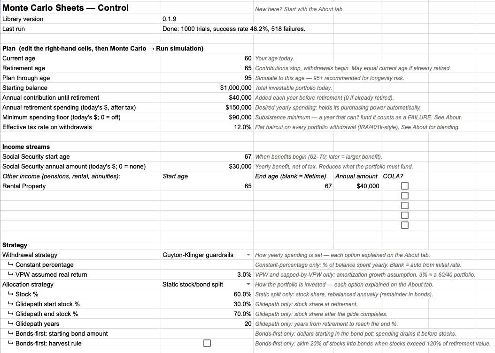
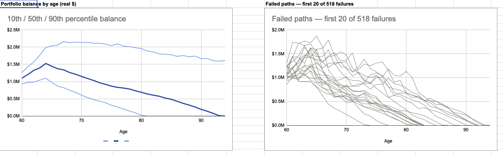
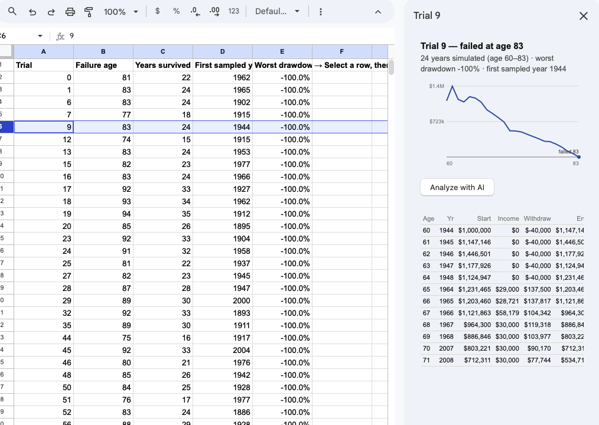
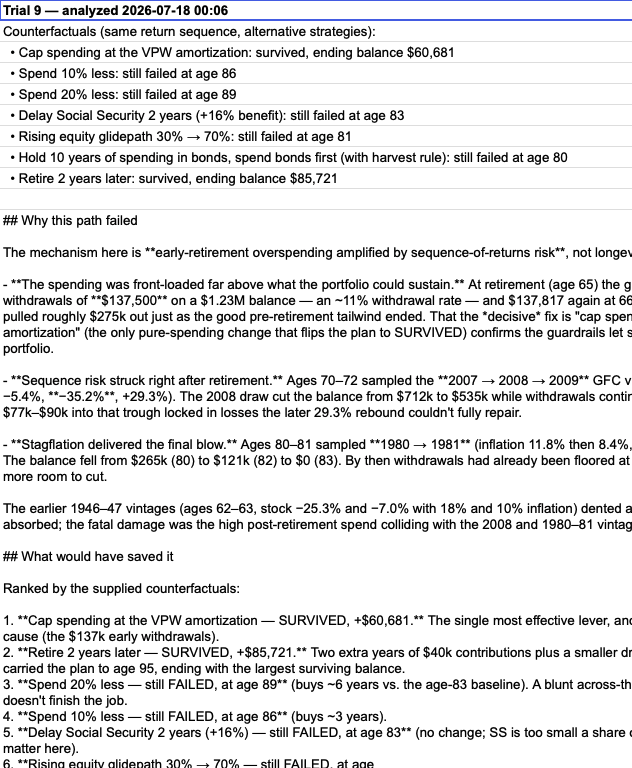
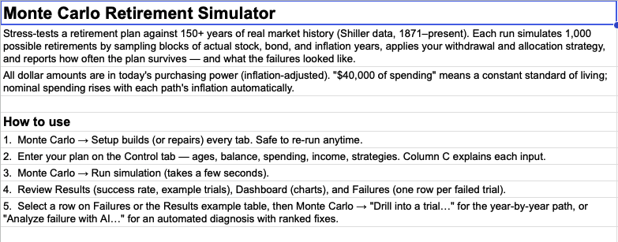

*The Control tab — your whole plan on one sheet: ages, balance, spending, Social Security and pensions, tax rate, and the strategy pickers, each input explained in place.*

### What it is

Monte Carlo Sheets answers the question every retirement plan hangs on: **"Will my money last?"** — and, more usefully, *"when it doesn't, why not, and what would have fixed it?"*

Instead of assuming markets follow a tidy statistical curve, it samples **blocks of consecutive real history** from Robert Shiller's 1871–present dataset: actual crashes, actual inflation decades, actual recoveries, kept in their real-world order so the multi-year bad stretches that genuinely sink retirements — 1929, the 1970s, 2008 — appear in the simulations with full force. Every run simulates 1,000 complete retirements in seconds, all in inflation-adjusted dollars, so "spending $40,000 a year" always means today's purchasing power.

### Strategies worth comparing

How you withdraw matters as much as how much you have. Monte Carlo Sheets ships five withdrawal strategies and three allocation strategies, all combinable:

- **Constant dollar (the real 4% rule)** — the same inflation-adjusted amount every year, regardless of markets.
- **Guyton-Klinger guardrails** — spending cuts when the portfolio struggles, raises when it prospers; the approach most professional planning tools use.
- **Constant percentage** — a fixed share of the current balance; can't run out, but income swings with markets.
- **VPW** — amortizes the portfolio over your remaining years, like a mortgage in reverse.
- **Constant dollar capped by VPW** — spend your plan, but never more than the amortization allows: cuts arrive before depletion is possible, and good-market surpluses compound untouched for your heirs.

Allocations: a classic **static split**, a **glidepath** (rising or declining equity), or **bonds-first** — separate stock and bond pots where spending drains bonds before a single share of stock is sold, with an optional harvest rule that skims big stock gains back into the bond buffer.

A **spending floor** keeps the adaptive strategies honest: spending never drops below your subsistence minimum, and a year that can't fund the floor counts as a failure — no strategy gets to "survive" on un-liveable income. Because runs are seeded and reproducible, two strategies can be compared against *identical* market sequences: the difference you see is pure strategy, not luck.

*The Dashboard — the 10th/50th/90th percentile balance by age, with every failed path drawn alongside so you can see exactly where plans go wrong.*

### See the failures, not just the odds

Most Monte Carlo tools hand you a single success percentage and stop. Monte Carlo Sheets treats the **failures as the interesting part**:

- The **Failures tab** lists every failed trial — the age it failed, how long it survived, its worst drawdown, and which historical era its returns were drawn from ("this one retired into 1966").
- **Drill into any trial** — failed or successful — for a year-by-year account: balance, returns, income, withdrawals, and the exact historical years each step was sampled from, with a chart of the path.

*The drill-down sidebar — one simulated retirement, year by year: what the market did, what was withdrawn, and where it came apart.*

### AI analysis that shows its work

Select any failed trial and ask for an analysis. Before a single word is written, the simulator **replays that trial's exact market sequence** under alternative strategies — spend 10% less, switch to guardrails, delay Social Security two years, hold a ten-year bond buffer, retire two years later — and records what each would have done: survived, or failed later, and with how much.

Only then does Claude (Anthropic's AI) write the analysis: why this path failed — sequence risk, overspending, inflation — and which fixes would actually have worked, **ranked by the replayed numbers, not by plausible-sounding advice**. "Spending 10% less still fails at 88; delaying Social Security two years survives with $310,000 to spare" is a different kind of answer than "consider spending less." The write-up lands on its own tab, one section per analyzed failure.

*An AI failure analysis — the failure mechanism explained, and every candidate fix scored by actually re-running the same market sequence with that change.*

### Your data stays yours

The template's design keeps your finances private by construction:

- **You own the spreadsheet.** Make a copy of the template and everything — inputs, results, analyses — lives in a Google Sheet in your Drive that nobody else can read.
- **Nothing is collected.** There's no backend, no telemetry, no account beyond the Google login you already have.
- **AI is optional and yours to control.** Analyses use a shared key by default; paste your own Anthropic API key (stored only in your copy) to use yours instead. The simulation itself never needs a key at all.
- **Always current.** The logic lives in a shared script library, so improvements arrive automatically — no re-copying, no updates to install.

*Built-in documentation — every strategy, every input, and concepts like block bootstrapping and the spending floor, explained inside the sheet itself.*

### Getting started

Make a copy of the template, run **Monte Carlo → Setup** from the menu, enter your plan on the Control tab, and click **Run simulation**. Results arrive in seconds. An **About** tab documents every strategy and input, and each Control cell carries a one-line explanation — no manual required.
