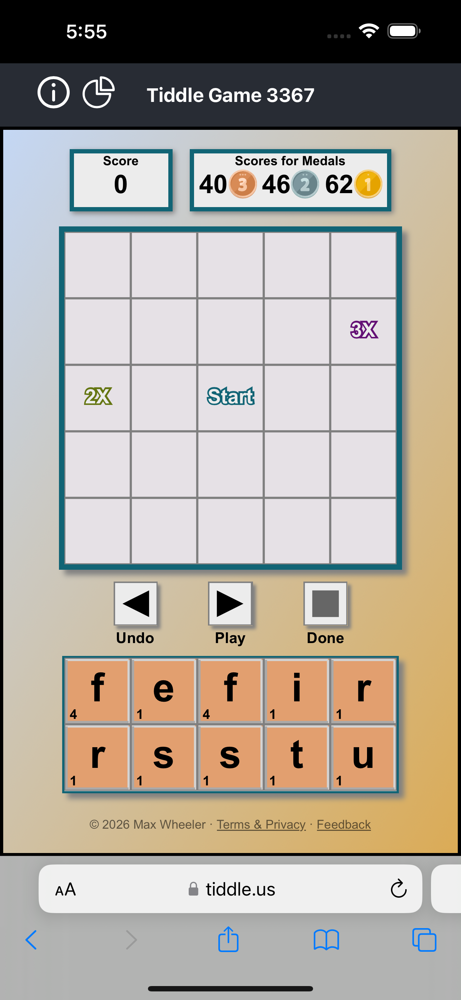
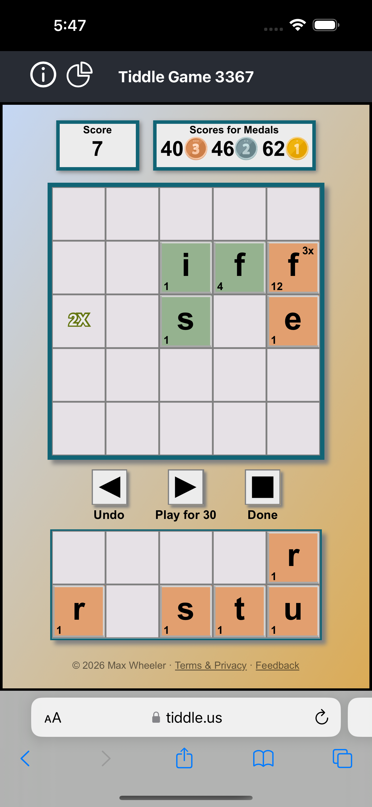
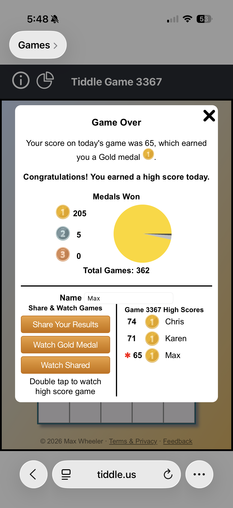
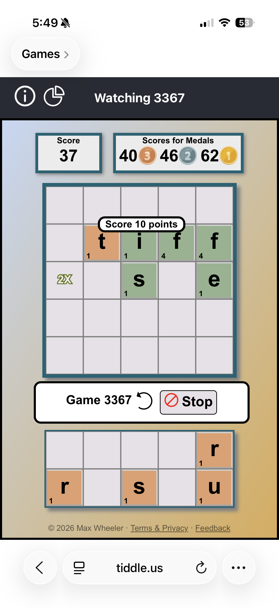

**Play it:** [https://tiddle.us](https://tiddle.us) · Free · No account required · A new puzzle every day · Runs in any modern browser (mobile-first; works on desktop & tablet)

*Today's puzzle — a 5×5 grid, your medal targets up top, and a rack of tiles to play. The center "Start" square and the 2× / 3× bonus squares are where the big scores come from.*

### What it is

Tiddle is a **daily word-and-tile puzzle**. Each day it hands you the same board and the same tiles as everyone else, and challenges you to squeeze the highest-scoring set of words out of them. It's quick to pick up — if you've ever played a tile word game, you already know the letters have point values — but there's real depth in *how* you build: the difference between a bronze and a gold is usually a clever bit of tile placement you didn't see the first time.

Everyone plays the same puzzle each day, so it's a shared daily ritual: compare scores, chase the leaderboard, and come back tomorrow for a brand-new grid.

### How you play

Play is relaxed and entirely at your own pace — there's no clock.

- **Place tiles** by dragging them onto the grid, or tapping a tile and then tapping where it should go.
- **Hit Play** to commit a move. Tiddle checks your word(s) against its dictionary and adds up the points; an invalid word just won't score, so you can experiment freely.
- **Build on what's there.** After your first word, every new play has to connect to tiles already on the board and form a contiguous word — and you score *all* the new words your move creates, so crossing words is where points pile up.
- **Undo** lets you take back a play (you get a handful of undos per puzzle), and **Done** ends the game when you've wrung out the best score you can. You don't have to use every tile.

Your **first word must run through the center "Start" square** and be at least two tiles long — everything grows outward from there.

*Mid-move — green tiles are words already locked in; the orange tiles are the new play you're building. Here an 'f' landing on the 3× square is worth 12, and the Play button previews the whole move's score ("Play for 30") before you commit.*

### Scoring & medals

Every letter carries a point value — common letters like E, A and S are cheap; a Q or a Z is worth a small fortune — so the game is a constant hunt for a place to cash in your heavy letters.

- **Bonus squares.** The **2×** and **3×** squares multiply the value of a tile played on them, but only the moment that tile is first laid down — so timing your expensive letters onto a bonus is a move worth planning.
- **Medals.** Each daily puzzle has a **target score** — a strong result the game's own solver found. Match the full target and you earn **gold**; reach roughly three-quarters of it for **silver**, or two-thirds for **bronze**. The targets keep even easy-looking boards honest.

### The daily puzzle & the leaderboard

A **new Tiddle drops every day**, the same for every player. Finish yours and you land on the day's **leaderboard** — the top scores for that exact puzzle, where you can sign your run with a name. Because everyone wrestled with the identical tiles, the board is a genuine head-to-head.

*The results screen — your medal and score, a lifetime "Medals Won" tally, and the day's leaderboard (your run is starred). From here you can share your game or watch a higher-scoring one.*

### Watch the best games

Losing to a score you can't imagine reaching? **Watch it happen.** From the results screen you can replay the game's **gold-medal solution**, or double-tap any entry on the leaderboard to **watch that player's game play out** move by move — the single fastest way to learn a new tactic. Replays step through tile by tile, and you can stop any time and drop straight back to your own board.

*Watching a game replay — Tiddle re-plays each move with running score popups so you can see exactly how a high score was built. Hit Stop any time to return to your own board.*

### Share your game

Beat a friend — or just proud of a clever grid? **Share it with one link.** Tiddle turns your finished game into a shareable page with a rich preview card showing your board, your score, and your medal, so it looks great when it lands in a text or a feed. Friends can open the link to play the same day's puzzle, or watch how you did it.

### Learn as you go

New to this kind of game? Tiddle eases you in:

- An **interactive tutorial** walks you through a real board, hands-on.
- **Instructions** lay out the rules in plain language, and a **Strategy** guide shares how to actually score big.
- Your **medal stats** — a lifetime tally of the bronze, silver, and gold you've earned — ride along on the results screen after every game.

### About

Tiddle is a free daily word game made by Max Wheeler. It runs entirely in the browser with no account and no install — your progress and daily streak of medals live right on your device. It's designed mobile-first, so it feels at home on a phone, but plays just as well on a tablet or desktop.
