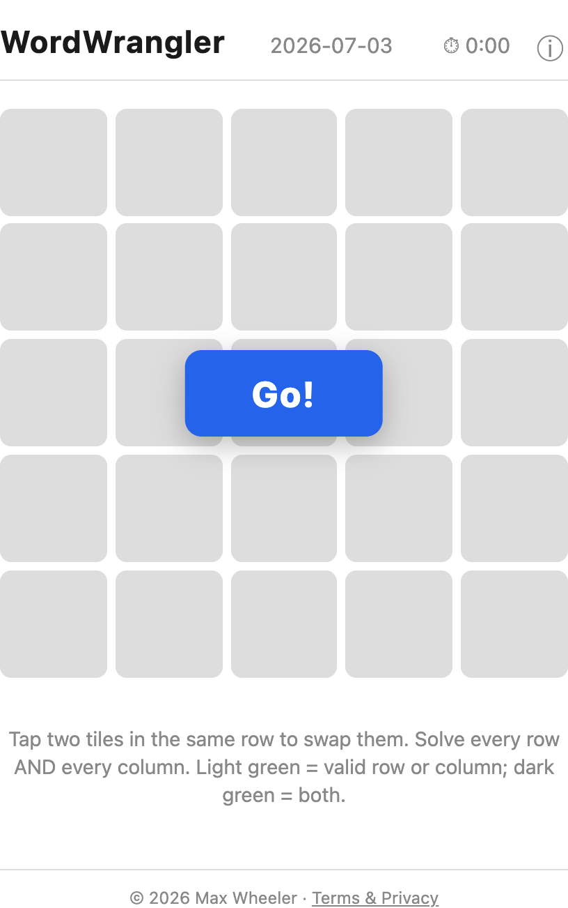
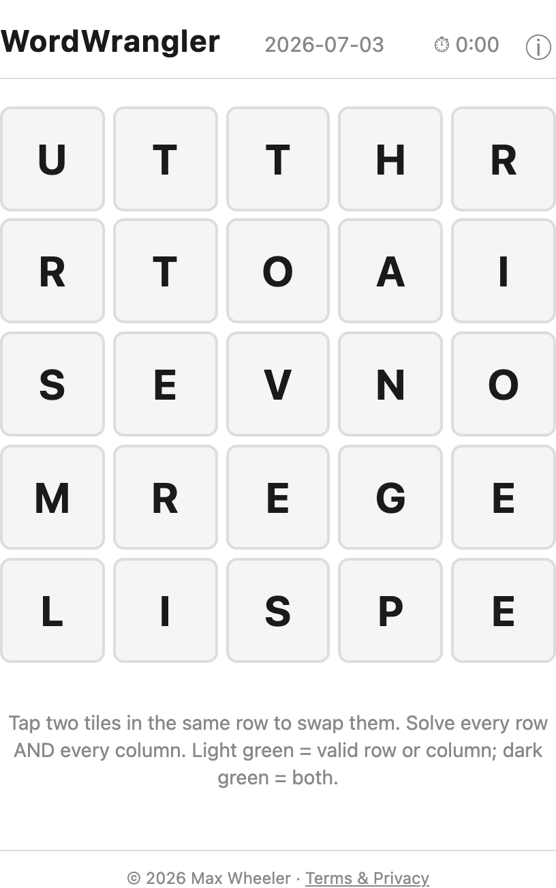
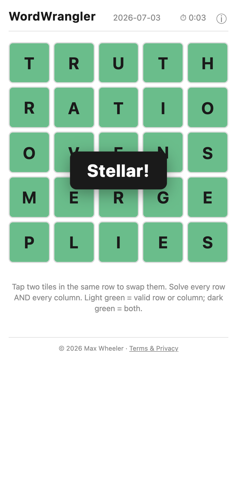
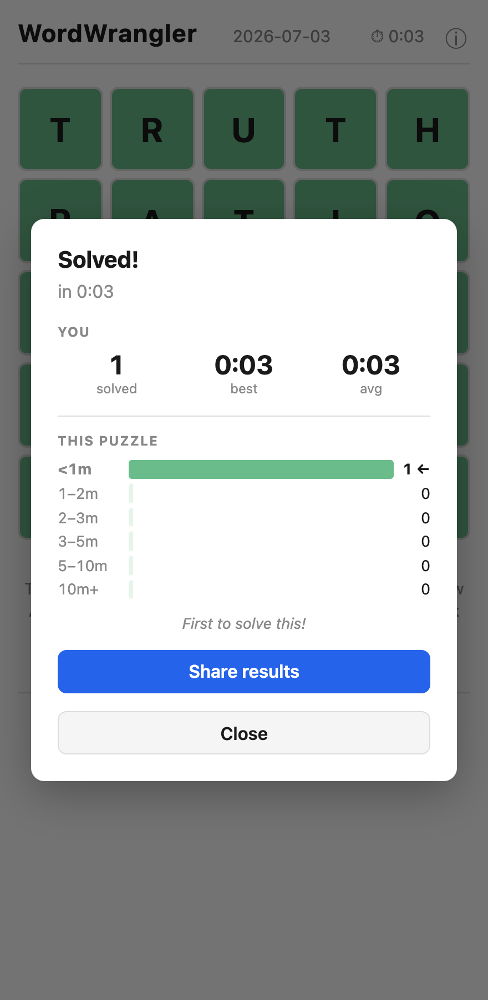
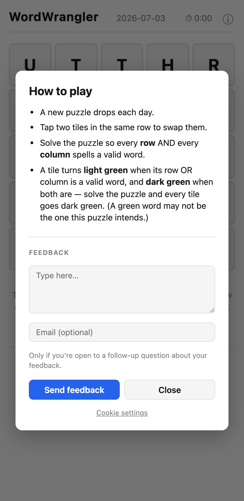

**Play it:** [https://wordwrangler.us](https://wordwrangler.us) · Free · No account required · A new puzzle every day · Runs in any modern browser (mobile, tablet & desktop) · Installable

*The daily puzzle waits face-down behind a "Go!" button — so the timer only starts, and the letters only reveal, once you're ready. The clock and the day's date sit right up top.*

### What it is

WordWrangler is a **daily word-square puzzle**. Every day you get one 5×5 grid, and the goal is simple to state and satisfying to pull off: arrange the letters so that **all five rows and all five columns spell valid words** at the same time. Twenty-five letters, ten words, one grid — every tile pulling double duty as part of a word going across and a word going down.

There's no dictionary to memorize and no trivia to know. It's pure spatial word-play: a small, self-contained puzzle you can finish in a few minutes, waiting for you fresh each day.

### How you play

Press **Go!** and the tiles flip up to reveal the day's scramble. From there it's all tapping:

- **Tap two tiles in the same row to swap them.** Each row is a jumble of the right letters in the wrong order — an anagram waiting to be sorted. You rearrange letters *within* a row; the letters never leave their row, so you're always working a solvable puzzle.
- **Tiles turn green as words fall into place** — **light green** when a tile's row *or* column is a valid word, and **dark green** when *both* are. Green is your compass: watch tiles deepen from light to dark as your rows and columns start to agree. (Careful, though: a green word isn't always *the* word the puzzle wants, since more than one arrangement can be valid — so the real goal is getting the whole grid dark green at once.)
- **Solve every row and every column** and the grid locks in — you've wrangled it.

*Tiles up, clock ticking. Each row is an anagram of a real word; swap letters within a row, one pair at a time, and watch for the columns to fall into place too.*

### The twist: across and down at once

What makes WordWrangler more than a stack of anagrams is that **rows and columns are solved simultaneously**. Fix a row and you've just rearranged five columns; fix a column and you've disturbed five rows. The satisfying part is finding the single configuration where everything agrees — that moment when the last swap turns the whole board green.

*Solved: every row and every column is a real word (FOLDS, OPERA, REGAL, TRIPE, HATES — and read them downward too). Crack it and the board lights up green with a little cheer.*

### Beat the clock and share it

A timer runs from the moment you hit Go, so WordWrangler isn't just *can you solve it* — it's *how fast*. When you finish, you get a results card with your time, your personal stats (puzzles solved, best time, average), and a breakdown of how today's solvers did. Then share a link so friends can try the same grid and see if they can beat your time.

*The finish line: your time, your running stats, and how the day's field stacked up — plus a one-tap Share so friends can race the same puzzle.*

### A daily ritual, built to be effortless

WordWrangler is made to slot into your day with zero friction:

- **One new puzzle every day** — a small ritual, like a crossword or a Wordle, but its own kind of challenge.
- **No account, ever** — open the page and play. Nothing to sign up for, nothing to log in to.
- **Free, with no interruptions** — just the puzzle.
- **Play anywhere** — it runs in any modern browser on your phone, tablet, or computer, and you can **install it** to your home screen or desktop like an app.
- **Learn in ten seconds** — a built-in "How to play" card lays out the rules, and there's a spot to send feedback right from the app.

*Everything you need to start is one tap away — a plain-language rules card, plus a built-in box to send bugs, ideas, or gripes straight to the maker.*

### About

WordWrangler is a small daily-puzzle project by Max Wheeler — part of [WheelerWorks](https://wheelerworks.us). It's free to play, needs no account, and adds a new grid every day.
